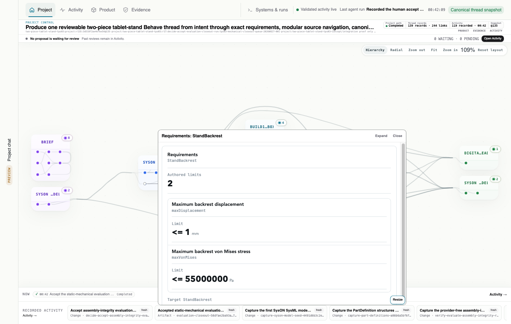

# @casys/mcp-syson

[](https://github.com/Casys-AI/mcp-syson/actions/workflows/publish.yml)
[](https://jsr.io/@casys/mcp-syson)
[](LICENSE)

A focused [Model Context Protocol](https://modelcontextprotocol.io) provider for
[SysON](https://mbse-syson.org) and SysML v2. It lets an MCP client work with a
real SysON model through explicit modelling, navigation, diagram, requirement,
constraint and value operations.



_A real recorded TPS03 requirements capture rendered by the provider-owned MCP
App. The viewer remains read-only and preserves authored limits without
inventing a satisfaction verdict._

## Built for small, useful views

The server pairs structured MCP results with compact MCP Apps. Each viewer owns
one bounded job—explore model elements, inspect a diagram, read query values,
review requirement links, check validation state or confirm a value—so a host
can compose them without embedding a second modelling application.

The same operations remain usable in clients without MCP App support. No tool
calls a language model: interpretation, approval and orchestration stay with the
calling client.

## Quick start

You need Deno 2.x and a SysON instance. The included development stack starts a
reviewed SysON image and PostgreSQL locally:

```bash
docker compose up -d
export SYSON_URL=http://localhost:8180
```

Run the published package over HTTP:

```bash
deno run -A jsr:@casys/mcp-syson@0.8.5/server
```

The MCP endpoint is <http://127.0.0.1:3009/mcp>. For a client that launches one
local process, use stdio instead:

```bash
deno run -A jsr:@casys/mcp-syson@0.8.5/server --stdio
```

An existing SysON deployment works too; point `SYSON_URL` at its base URL. The
server never guesses an endpoint.

See [Getting started](docs/getting-started.md) for Docker, transport, category,
authentication and renderer configuration.

## What it helps with

- Create projects, documents, packages and explicit SysML v2 structures.
- Browse and query model elements while preserving SysON identifiers.
- Render diagrams locally by default, with an opt-in external renderer.
- Trace requirements and derive product structures from model evidence.
- Evaluate unit-aware constraints and explore bounded what-if values.
- Update model values and perform fail-closed destructive operations.

The provider does not turn an acknowledgement into proof. Critical writes need
read-back, unresolved values stay unresolved, and permanent deletion is only
reported after its postcondition is observed. The exact safety and evidence
semantics live in
[Capabilities, safety and evidence](docs/capabilities-and-safety.md).

## Documentation

- [Getting started and configuration](docs/getting-started.md)
- [Capabilities, safety and evidence](docs/capabilities-and-safety.md)
- [MCP Apps and recorded viewer contracts](docs/mcp-apps.md)
- [Provider APIs, architecture and development](docs/provider-development.md)
- [Release history](CHANGELOG.md)
- [Private vulnerability reporting](SECURITY.md)

## Development

```bash
deno task check
deno task lint
deno task fmt
deno task test
```

Viewer development uses the audited local MCP View split and requires a rebuild
after source changes. The complete loop is documented in
[MCP Apps and recorded viewer contracts](docs/mcp-apps.md#build-and-verify).

## License

[MIT](LICENSE)
